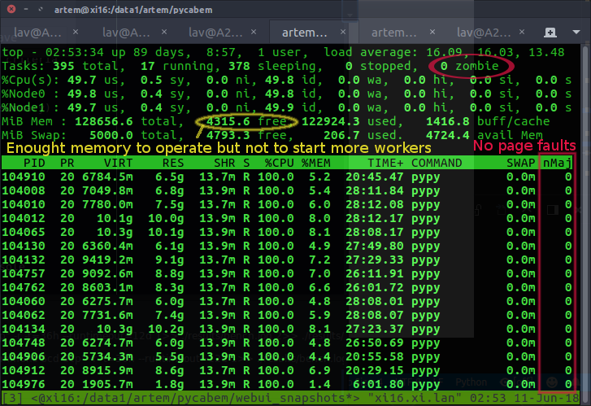
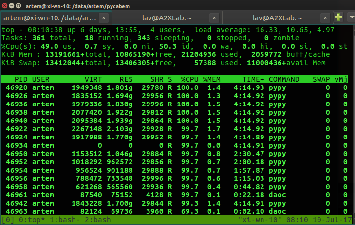
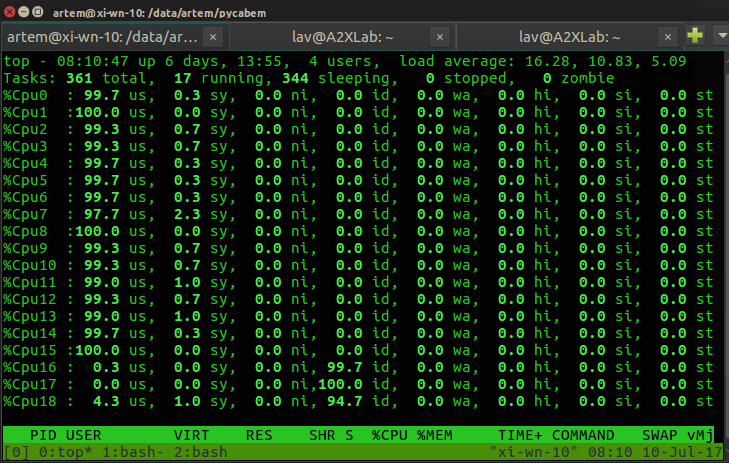
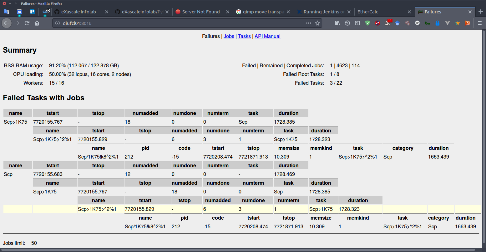
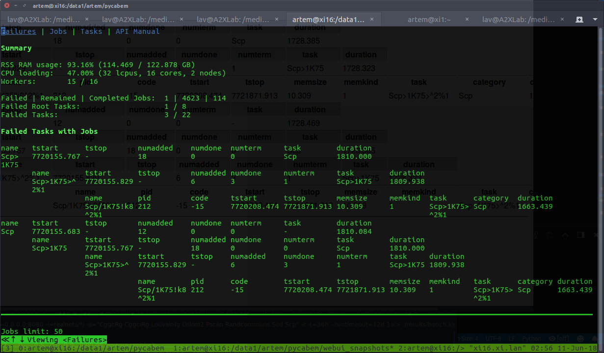

# PyExPool

A Lightweight Multi-Process Execution Pool with load balancing and customizable resource consumption constraints.

\author: (c) Artem Lutov <artem@exascale.info>  
\license:  [Apache License, Version 2.0](https://www.apache.org/licenses/LICENSE-2.0)  
\organizations: [eXascale Infolab](http://exascale.info/), [Lumais](http://www.lumais.com/), [ScienceWise](http://sciencewise.info/)  
\date: 2015-07 v1, 2017-06 v2, 2018-05 v3

BibTeX:
```bibtex
@misc{pyexpool,
	author = {Artem Lutov and Philippe Cudré-Mauroux},
	title = {{PyExPool-v.3: A Lightweight Execution Pool with Constraint-aware Load-Balancer.}},
	year = {2018},
	url = {https://github.com/eXascaleInfolab/PyExPool}
}
```

## Content  <!-- omit in toc -->
- [Overview](#overview)
- [Installation](#installation)
- [Requirements](#requirements)
- [API](#api)
	- [Job](#job)
	- [Task](#task)
	- [AffinityMask](#affinitymask)
	- [ExecPool](#execpool)
	- [Optional Extensions](#optional-extensions)
		- [WebUiApp](#webuiapp)
		- [UiCmd](#uicmd)
	- [Accessory Routines](#accessory-routines)
- [Usage](#usage)
	- [Usage Example](#usage-example)
	- [Failsafe Termination](#failsafe-termination)
- [Related Projects](#related-projects)


## Overview
A Lightweight Multi-Process Execution Pool with load balancing to schedule Jobs execution with *per-job timeout*, optionally grouping them into Tasks and specifying optional execution parameters considering NUMA architecture peculiarities:
- automatic rescheduling and *load balancing* (reduction) of the worker processes and on low memory condition for the *in-RAM computations* (requires [psutil](https://pypi.python.org/pypi/psutil), can be disabled)
- *chained termination* of the related worker processes (started jobs) and non-started jobs rescheduling to satisfy *timeout* and *memory limit* constraints
- automatic CPU affinity management and maximization of the dedicated CPU cache vs parallelization for a worker process
- *timeout per each Job* (it was the main initial motivation to implement this module, because this feature is not provided by any Python implementation out of the box)
- onstart/ondone *callbacks*, ondone is called only on successful completion (not termination) for both Jobs and Tasks (group of jobs)
- stdout/err output, which can be redirected to any custom file or PIPE
- custom parameters for each Job and respective owner Task besides the name/id

> Automatic rescheduling of the workers on low memory condition for the in-RAM computations is an optional and the only feature that requires an external package, [psutil](https://pypi.python.org/pypi/psutil).  
All scheduling jobs share the same CPU affinity policy, which is convenient for the benchmarking, but not so suitable for scheduling both single and multi-threaded apps with distinct demands for the CPU cache.

All main functionality is implemented as a *single-file module* to be *easily included into your project and customized as a part of your distribution* (like in [PyCaBeM](https://github.com/eXascaleInfolab/PyCABeM)), not as a separate library. Additionally, an optional minimalistic Web interface is provided in the separate file to inspect and profile the load balancer and execution pool.  
The main purpose of the main single-file module is the **concurrent execution of modules and external executables with custom resource consumption constraints, cache / parallelization tuning and automatic balancing of the worker processes for the in memory computations on the single server**. PyExPool is typically used as an application framework for benchmarking or heavy-loaded multi-process execution activities on constrained computational resources.  
If the concurrent execution of *Python functions* is required, usage of external modules is not a problem and the automatic jobs scheduling for the in-RAM computations is not necessary, then a more handy and straightforward approach is to use [Pebble](https://pypi.python.org/pypi/Pebble) library. A pretty convenient transparent parallel computations are provided by the [Joblib](https://pythonhosted.org/joblib/). If a distributed task queue is required with advanced monitoring and reporting facilities then [Celery](http://www.celeryproject.org/) might be a good choice. For the comprehensive parallel computing [Dask](http://dask.pydata.org) is a good choice. For the parallel execution of only the shell scripts the [GNU parallel](https://en.wikipedia.org/wiki/GNU_parallel) might be a good option.

The **load balancing** is enabled when the global variables `_LIMIT_WORKERS_RAM` and `_CHAINED_CONSTRAINTS` are set, jobs `.category` and relative `.size` (if known) specified. The balancing is performed to use as much RAM and CPU resources as possible performing in-RAM computations and meeting the specified timeout and memory constraints for each job and for the whole pool.  
Large executing jobs can be postponed for the later execution with less number of worker processes after completion of the smaller jobs. The number of workers is reduced automatically (balanced) on the jobs queue processing to meet memory constraints. It is recommended to add jobs in the order of the increasing memory/time complexity if possible to reduce the number of worker processes terminations on jobs postponing (rescheduling).

Demo of the *scheduling with memory constraints* for the worker processes:

> Zombie processes still may appear on abnormal termination of worker processes during rescheduling due to some bug in the Python interpreter. Anyway all resources are clearer up and the zombies disappear on the execution pool completion.

Demo of the *scheduling with cache L1 maximization* for single-threaded processes on the server with cross-node CPUs enumeration. Whole physical CPU core consisting of two hardware threads assigned to each worker process, so the L1 cache is dedicated (not shared), but the maximal loading over all CPUs is 50%:



Demo of the WebUI for the Jobs and Tasks tracing and profiling:

Exactly the same fully funcitonal interface is accessible from the console using [w3m](http://w3m.sourceforge.net/) or other terminal browsers:


## Installation

Include the following modules:
- [mpepool](mpepool.py)  - execution pool with load balancer, the only mandatory module,
- [mpewui](mpewui.py)  - optional WebUI for the interactive profiling of the scheduled Jobs and Tasks.

These modules can be install either manually from [GitHub](https://github.com/eXascaleInfolab/PyExPool) or from the [pypi repository](https://pypi.org/project/pyexpool/):
```sh
$ pip install pyexpool
```
> WebUI(`mpewui` module) renders interface from the bottle html templates located in the `./views/` (or any folder in the `bottle.TEMPLATE_PATH` list). So, `views/*` should be copied from the `pyexpool` repository to the target project.

Additionally, [hwloc / lstopo](http://www.admin-magazine.com/HPC/Articles/hwloc-Which-Processor-Is-Running-Your-Service) should be installed if customized CPU affinity masking and cach control are required, see [Requirements](#requirements) section.


## Requirements

Multi-Process Execution Pool *can be run without any external modules* with automatically disabled load balancing.  
The external modules / apps are required only for the extended functionality:
- [psutil](https://pypi.python.org/pypi/psutil) is required for the dynamic jobs balancing to perform the in-RAM computations (`_LIMIT_WORKERS_RAM = True`) and limit memory consumption of the workers.
	```sh
	$ sudo pip install psutil
	```
	> To perform in-memory computations dedicating almost all available RAM (specifying *memlimit ~= physical memory*), it is recommended to set swappiness to 1 .. 10: `$ sudo sysctl -w vm.swappiness=5` or set it permanently in `/etc/sysctl.conf`: `vm.swappiness = 5`.
- [hwloc](http://www.admin-magazine.com/HPC/Articles/hwloc-Which-Processor-Is-Running-Your-Service) (includes `lstopo`) is required to identify enumeration type of logical CPUs to perform correct CPU affinity masking. Required only for the automatic affinity masking with cache usage optimization and only if the CPU enumeration type is not specified manually.
	```sh
	$ sudo apt-get install -y hwloc
	```
- [bottle](http://bottlepy.org) is required for the minimalistic optional WebUI to monitor executing jobs.
	```sh
	$ sudo pip install bottle
	```
	> WebUI renders interface from the bottle html templates located in the `./views/` (or any folder in the `bottle.TEMPLATE_PATH` list). So, `pyexpool/views/*` should be copied to the target project.
	
- [mock](https://pypi.python.org/pypi/mock) is required exclusively for the unit testing under Python2, `mock` is included in the standard lib of Python3.
	```sh
	$ sudo pip install mock
	```

All Python requirements are optional and can be installed from the `pyreqsopt.txt` file:
```sh
$ sudo pip install -r pyreqsopt.txt
```
> `hwloc` is a system requirement and can't be installed from the `pyreqsopt.txt`


## API

Flexible API provides *automatic CPU affinity management, maximization of the dedicated CPU cache, limitation of the minimal dedicated RAM per worker process, balancing of the worker processes and rescheduling of chains of the related jobs on low memory condition for the in-RAM computations*, optional automatic restart of jobs on timeout, access to job's process, parent task, start and stop execution time and more...  
`ExecPool` represents a pool of worker processes to execute `Job`s that can be grouped into `Tasks`s for more flexible management.


### Job

```python
# Global Parameters
# Limit the amount of memory (<= RAM) used by worker processes
# NOTE: requires import of psutils
_LIMIT_WORKERS_RAM = True

# Use chained constraints (timeout and memory limitation) in jobs to terminate
# also related worker processes and/or reschedule jobs, which have the same
# category and heavier than the origin violating the constraints
 CHAINED_CONSTRAINTS = True


Job(name, workdir=None, args=(), timeout=0, rsrtonto=False, task=None
	, startdelay=0., onstart=None, ondone=None, params=None, category=None
	, size=0, slowdown=1., omitafn=False, memkind=1, stdout=sys.stdout, stderr=sys.stderr):
	"""Initialize job to be executed

	Job is executed in a separate process via Popen or Process object and is
	managed by the Process Pool Executor

	Main parameters:
	name: str  - job name
	workdir  - working directory for the corresponding process, None means the dir of the benchmarking
	args  - execution arguments including the executable itself for the process
		NOTE: can be None to make make a stub process and execute the callbacks
	timeout  - execution timeout in seconds. Default: 0, means infinity
	rsrtonto  - restart the job on timeout, Default: False. Can be used for
		non-deterministic Jobs like generation of the synthetic networks to regenerate
		the network on border cases overcoming getting stuck on specific values of the rand variables.
	task: Task  - origin task if this job is a part of the task
	startdelay  - delay after the job process starting to execute it for some time,
		executed in the CONTEXT OF THE CALLER (main process).
		ATTENTION: should be small (0.1 .. 1 sec)
	onstart  - a callback, which is executed on the job starting (before the execution
		started) in the CONTEXT OF THE CALLER (main process) with the single argument,
		the job. Default: None
		ATTENTION: must be lightweight
		NOTE: can be executed a few times if the job is restarted on timeout
	ondone  - a callback, which is executed on successful completion of the job in the
		CONTEXT OF THE CALLER (main process) with the single argument, the job. Default: None
		ATTENTION: must be lightweight
	params  - additional parameters to be used in callbacks
	stdout  - None or file name or PIPE for the buffered output to be APPENDED.
		The path is interpreted in the CONTEXT of the CALLER
	stderr  - None or file name or PIPE or STDOUT for the unbuffered error output to be APPENDED
		ATTENTION: PIPE is a buffer in RAM, so do not use it if the output data is huge or unlimited.
		The path is interpreted in the CONTEXT of the CALLER

	Scheduling parameters:
	omitafn  - omit affinity policy of the scheduler, which is actual when the affinity is enabled
		and the process has multiple treads
	category  - classification category, typically semantic context or part of the name,
		used to identify related jobs;
		requires _CHAINED_CONSTRAINTS
	size  - expected relative memory complexity of the jobs of the same category,
		typically it is size of the processing data, >= 0, 0 means undefined size
		and prevents jobs chaining on constraints violation;
		used on _LIMIT_WORKERS_RAM or _CHAINED_CONSTRAINTS
	slowdown  - execution slowdown ratio, >= 0, where (0, 1) - speedup, > 1 - slowdown; 1 by default;
		used for the accurate timeout estimation of the jobs having the same .category and .size.
		requires _CHAINED_CONSTRAINTS
	memkind  - kind of memory to be evaluated (average of virtual and resident memory
		to not overestimate the instant potential consumption of RAM):
		0  - mem for the process itself omitting the spawned sub-processes (if any)
		1  - mem for the heaviest process of the process tree spawned by the original process
			(including the origin itself)
		2  - mem for the whole spawned process tree including the origin process

	Execution parameters, initialized automatically on execution:
	tstart  - start time, filled automatically on the execution start (before onstart). Default: None
	tstop  - termination / completion time after ondone
		NOTE: onstart() and ondone() callbacks execution is included in the job execution time
	proc  - process of the job, can be used in the ondone() to read it's PIPE
	mem  - consuming memory (smooth max of average of VMS and RSS, not just the current value)
		or the least expected value inherited from the jobs of the same category having non-smaller size;
		requires _LIMIT_WORKERS_RAM
	terminates  - accumulated number of the received termination requests caused by the constraints violation
		NOTE: > 0 (1 .. ExecPool._KILLDELAY) for the apps terminated by the execution pool
			(resource constrains violation or ExecPool exception),
			== 0 for the crashed apps
	wkslim  - worker processes limit (max number) on the job postponing if any,
		the job is postponed until at most this number of worker procs operate;
		requires _LIMIT_WORKERS_RAM
	chtermtime  - chained termination: None - disabled, False - by memory, True - by time;
		requires _CHAINED_CONSTRAINTS
	"""
```

### Task
```python
Task(name, timeout=0, onstart=None, ondone=None, onfinish=None, params=None
	, task=None, latency=1.5, stdout=sys.stdout, stderr=sys.stderr):
	"""Initialize task, which is a group of subtasks including jobs to be executed

	Task is a managing container for subtasks and Jobs.
	Note: the task is considered to be failed if at least one subtask / job is failed
	(terminated or completed with non-zero return code).

	name: str  - task name
	timeout  - execution timeout in seconds. Default: 0, means infinity. ATTENTION: not implemented
	onstart  - a callback, which is executed on the task start (before the subtasks/jobs execution
		started) in the CONTEXT OF THE CALLER (main process) with the single argument,
		the task. Default: None
		ATTENTION: must be lightweight
	ondone  - a callback, which is executed on the SUCCESSFUL completion of the task in the
		CONTEXT OF THE CALLER (main process) with the single argument, the task. Default: None
		ATTENTION: must be lightweight
	onfinish  - a callback, which is executed on either completion or termination of the task in the
		CONTEXT OF THE CALLER (main process) with the single argument, the task. Default: None
		ATTENTION: must be lightweight
	params  - additional parameters to be used in callbacks
	task: Task  - optional owner super-task
	latency: float  - lock timeout in seconds: None means infinite,
		<= 0 means non-bocking, > 0 is the actual timeout
	stdout  - None or file name or PIPE for the buffered output to be APPENDED
	stderr  - None or file name or PIPE or STDOUT for the unbuffered error output to be APPENDED
		ATTENTION: PIPE is a buffer in RAM, so do not use it if the output data is huge or unlimited

	Automatically initialized and updated properties:
	tstart  - start time is filled automatically on the execution start (before onstart). Default: None
	tstop  - termination / completion time after ondone.
	numadded: uint  - the number of direct added subtasks
	numdone: uint  - the number of completed DIRECT subtasks
		(each subtask may contain multiple jobs or sub-sub-tasks)
	numterm: uint  - the number of terminated direct subtasks (i.e. jobs)
	"""
```

### AffinityMask
```python
AffinityMask(afnstep, first=True, sequential=cpusequential())
	"""Affinity mask

	Affinity table is a reduced CPU table by the non-primary HW treads in each core.
	Typically, CPUs are enumerated across the nodes:
	NUMA node0 CPU(s):     0,2,4,6,8,10,12,14,16,18,20,22,24,26,28,30
	NUMA node1 CPU(s):     1,3,5,7,9,11,13,15,17,19,21,23,25,27,29,31
	In case the number of HW threads per core is 2 then the physical CPU cores are 1 .. 15:
	NUMA node0 CPU(s):     0,2,4,6,8,10,12,14	(16,18,20,22,24,26,28,30  - 2nd HW treads)
	NUMA node1 CPU(s):     1,3,5,7,9,11,13,15	(17,19,21,23,25,27,29,31  - 2nd HW treads)
	But the enumeration can be also sequential:
	NUMA node0 CPU(s):     0,(1),2,(3),...
	...

	Hardware threads share all levels of the CPU cache, physical CPU cores share only the
	last level of the CPU cache (L2/3).
	The number of worker processes in the pool should be equal to the:
	- physical CPU cores for the cache L1/2 maximization
	- NUMA nodes for the cache L2/3 maximization

	NOTE: `hwloc` utility can be used to detect the type of logical CPUs enumeration:
	`$ sudo apt-get install hwloc`
	See details: http://www.admin-magazine.com/HPC/Articles/hwloc-Which-Processor-Is-Running-Your-Service

	afnstep: int  - affinity step, integer if applied, allowed values:
		1, CORE_THREADS * n,  n E {1, 2, ... CPUS / (NODES * CORE_THREADS)}

		Used to bind worker processes to the logical CPUs to have warm cache and,
		optionally, maximize cache size per a worker process.
		Groups of logical CPUs are selected in a way to maximize the cache locality:
		the single physical CPU is used taking all it's hardware threads in each core
		before allocating another core.

		Typical Values:
		1  - maximize parallelization for the single-threaded apps
			(the number of worker processes = logical CPUs)
		CORE_THREADS  - maximize the dedicated CPU cache L1/2
			(the number of worker processes = physical CPU cores)
		CPUS / NODES  - maximize the dedicated CPU cache L3
			(the number of worker processes = physical CPUs)
	first  - mask the first logical unit or all units in the selected group.
		One unit per the group maximizes the dedicated CPU cache for the
		single-threaded worker, all units should be used for the multi-threaded
		apps.
	sequential  - sequential or cross nodes enumeration of the CPUs in the NUMA nodes:
		None  - undefined, interpreted as cross-nodes (the most widely used on servers)
		False  - cross-nodes
		True  - sequential

		For two hardware threads per a physical CPU core, where secondary HW threads
		are taken in brackets:
		Crossnodes enumeration, often used for the server CPUs
		NUMA node0 CPU(s):     0,2(,4,6)
		NUMA node1 CPU(s):     1,3(,5,7)
		Sequential enumeration, often used for the laptop CPUs
		NUMA node0 CPU(s):     0(,1),2(,3)
		NUMA node1 CPU(s):     4(,5),6(,7)
	"""
```

### ExecPool
```python
ExecPool(wksnum=max(cpu_count()-1, 1), afnmask=None, memlimit=0., latency=0., name=None, webuiapp=None)
	"""Multi-process execution pool of jobs

	A worker in the pool executes only a single job, a new worker is created for
	each subsequent job.

	wksnum: int  - number of resident worker processes, >=1. The reasonable
		value <= logical CPUs (returned by cpu_count()) = NUMA nodes * node CPUs,
		where node CPUs = CPU cores * HW treads per core.
		The recommended value is max(cpu_count() - 1, 1) to leave one logical
		CPU for the benchmarking framework and OS applications.

		To guarantee minimal average RAM per a process, for example 2.5 GB
		without _LIMIT_WORKERS_RAM flag (not using psutil for the dynamic
		control of memory consumption):
			wksnum = min(cpu_count(), max(ramfracs(2.5), 1))
	afnmask  - affinity mask for the worker processes, AffinityMask
		None if not applied
	memlimit  - limit total amount of Memory (automatically reduced to
		the amount of physical RAM if the larger value is specified) in gigabytes
		that can be used by worker processes to provide in-RAM computations, >= 0.
		Dynamically reduces the number of workers to consume not more memory
		than specified. The workers are rescheduled starting from the
		most memory-heavy processes.
		NOTE:
			- applicable only if _LIMIT_WORKERS_RAM
			- 0 means unlimited (some jobs might be [partially] swapped)
			- value > 0 is automatically limited with total physical RAM to process
				jobs in RAM almost without the swapping
	latency  - approximate minimal latency of the workers monitoring in sec, float >= 0;
		0 means automatically defined value (recommended, typically 2-3 sec)
	name  - name of the execution pool to distinguish traces from subsequently
		created execution pools (only on creation or termination)
	webuiapp: WebUiApp  - WebUI app to inspect load balancer remotely

	Internal attributes:
	alive  - whether the execution pool is alive or terminating, bool.
		Should be reseted to True on reuse after the termination.
		NOTE: should be reseted to True if the execution pool is reused
		after the joining or termination.
	failures: [JobInfo]  - failed (terminated or crashed) jobs with timestamps.
		NOTE: failures contain both terminated, crashed jobs that jobs completed with non-zero return code
		excluding the jobs terminated by timeout that have set .rsrtonto (will be restarted)
	tasks: set(Task)  - tasks associated with the scheduled jobs
	"""

	execute(job, concur=True):
		"""Schedule the job for the execution

		job: Job  - the job to be executed, instance of Job
		concur: bool  - concurrent execution or wait until execution completed
			 NOTE: concurrent tasks are started at once
		return int  - 0 on successful execution, process return code otherwise
		"""

	join(timeout=0):
		"""Execution cycle

		timeout: int  - execution timeout in seconds before the workers termination, >= 0.
			0 means unlimited time. The time is measured SINCE the first job
			was scheduled UNTIL the completion of all scheduled jobs.
		return bool  - True on graceful completion, False on termination by the specified
			constraints (timeout, memory limit, etc.)
		"""

	clear():
		"""Clear execution pool to reuse it

		Raises:
			ValueError: attempt to clear a terminating execution pool
		"""

	__del__():
		"""Force termination of the pool"""

	__finalize__():
		"""Force termination of the pool"""
```

### Optional Extensions
#### WebUiApp
```python
WebUiApp(host='localhost', port=8080, name=None, daemon=None, group=None, args=(), kwargs={})
	"""WebUI App starting in the dedicated thread and providing remote interface to inspect ExecPool

	ATTENTION: Once constructed, the WebUI App lives in the dedicated thread until the main program exit.

	Args:
		uihost: str  - Web UI host
		uiport: uint16  - Web UI port
		name: str  - The thread name. By default, a unique name
			is constructed of the form “Thread-N” where N is a small decimal number.
		daemon: bool  - Start the thread in the daemon mode to
			be automatically terminated on the main app exit.
		group  - Reserved for future extension
			when a ThreadGroup class is implemented.
		args: tuple  - The argument tuple for the target invocation.
		kwargs: dict  - A dictionary of keyword arguments for the target invocation.

	Internal attributes:
		cmd: UiCmd  - UI command to be executed, which includes (reserved) attribute(s) for the invocation result.
	"""
```

#### UiCmd
```python
UiCmdId = IntEnum('UiCmdId', 'FAILURES LIST_JOBS LIST_TASKS API_MANUAL')
"""UI Command Identifier associated with the REST URL"""
```

See [WebUI queries tutorial](views/restapi.htm) for details. An example of the WebUI usage is shown in the `mpetests.TestWebUI.test_failures` of the [mpetests.py](mpetests.py).
<!-- webui.md#webui-queries -->


### Accessory Routines
```python
def ramfracs(fracsize):
	"""Evaluate the minimal number of RAM fractions of the specified size in GB

	Used to estimate the reasonable number of processes with the specified minimal
	dedicated RAM.

	fracsize  - minimal size of each fraction in GB, can be a fractional number
	return the minimal number of RAM fractions having the specified size in GB
	"""

def cpucorethreads():
	"""The number of hardware treads per a CPU core

	Used to specify CPU affinity dedicating the maximal amount of CPU cache L1/2.
	"""

def cpunodes():
	"""The number of NUMA nodes, where CPUs are located

	Used to evaluate CPU index from the affinity table index considering the NUMA architecture.
	"""
	
def cpusequential():
	"""Enumeration type of the logical CPUs: cross-nodes or sequential

	The enumeration can be cross-nodes starting with one hardware thread per each
	NUMA node, or sequential by enumerating all cores and hardware threads in each
	NUMA node first.
	For two hardware threads per a physical CPU core, where secondary hw threads
	are taken in brackets:
		Crossnodes enumeration, often used for the server CPUs
		NUMA node0 CPU(s):     0,2(,4,6)		=> PU L#1 (P#4)
		NUMA node1 CPU(s):     1,3(,5,7)
		Sequential enumeration, often used for the laptop CPUs
		NUMA node0 CPU(s):     0(,1),2(,3)		=> PU L#1 (P#1)  - indicates sequential
		NUMA node1 CPU(s):     4(,5),6(,7)
	ATTENTION: `hwloc` utility is required to detect the type of logical CPUs
	enumeration:  `$ sudo apt-get install hwloc`
	See details: http://www.admin-magazine.com/HPC/Articles/hwloc-Which-Processor-Is-Running-Your-Service

	return  - enumeration type of the logical CPUs, bool or None:
		None  - was not defined, most likely cross-nodes
		False  - cross-nodes
		True  - sequential
	"""
```


## Usage

Target version of the Python is 2.7+ including 3.x, also works fine on PyPy.

The workflow consists of the following steps:

1. Create Execution Pool.
1. Create and schedule Jobs with required parameters, callbacks and optionally packing them into Tasks.
1. Wait on Execution pool until all the jobs are completed or terminated, or until the global timeout is elapsed.

See [unit tests](mpetests.py) (`TestExecPool`, `TestProcMemTree`, `TestTasks` classes) for the advanced examples.


### Usage Example
```python
from multiprocessing import cpu_count
from sys import executable as PYEXEC  # Full path to the current Python interpreter
from mpepool import AffinityMask, ExecPool, Job, Task  # Import all required classes

# 1. Create Multi-process execution pool with the optimal affinity step to maximize the dedicated CPU cache size
execpool = ExecPool(max(cpu_count() - 1, 1), cpucorethreads())
global_timeout = 30 * 60  # 30 min, timeout to execute all scheduled jobs or terminate them


# 2. Schedule jobs execution in the pool

# 2.a Job scheduling using external executable: "ls -la"
execpool.execute(Job(name='list_dir', args=('ls', '-la')))


# 2.b Job scheduling using python function / code fragment,
# which is not a goal of the design, but is possible.

# 2.b.1 Create the job with specified parameters
jobname = 'NetShuffling'
jobtimeout = 3 * 60  # 3 min

# The network shuffling routine to be scheduled as a job,
# which can also be a call of any external executable (see 2.alt below)
args = (PYEXEC, '-c',
"""import os
import subprocess

basenet = '{jobname}' + '{_EXTNETFILE}'
#print('basenet:', basenet, file=sys.stderr)
for i in range(1, {shufnum} + 1):
	netfile = ''.join(('{jobname}', '.', str(i), '{_EXTNETFILE}'))
	if {overwrite} or not os.path.exists(netfile):
		# sort -R pgp_udir.net -o pgp_udir_rand3.net
		subprocess.call(('sort', '-R', basenet, '-o', netfile))
""".format(jobname=jobname, _EXTNETFILE='.net', shufnum=5, overwrite=False))

# 2.b.2 Schedule the job execution, which might be postponed
# if there are no any free executor processes available
execpool.execute(Job(name=jobname, workdir='this_sub_dir', args=args, timeout=jobtimeout
	# Note: onstart/ondone callbacks, custom parameters and others can be also specified here!
))

# Add another jobs
# ...


# 3. Wait for the jobs execution for the specified timeout at most
execpool.join(global_timeout)  # 30 min
```

In case the execution pool is required locally then it can be used in the following way:
```python
...
# Limit of the memory consumption for the all worker processes with max(32 GB, RAM)
# and provide latency of 1.5 sec for the jobs rescheduling
with ExecPool(max(cpu_count()-1, 1), vmlimit=32, latency=1.5) as xpool:
	job = Job('jmem_proc', args=(PYEXEC, '-c', TestProcMemTree.allocAndSpawnProg(
		allocDelayProg(inBytes(amem), duration), allocDelayProg(inBytes(camem), duration)))
		, timeout=timeout, memkind=0, ondone=mock.MagicMock())
	jobx = Job('jmem_max-subproc', args=(PYEXEC, '-c', TestProcMemTree.allocAndSpawnProg(
		allocDelayProg(inBytes(amem), duration), allocDelayProg(inBytes(camem), duration)))
		, timeout=timeout, memkind=1, ondone=mock.MagicMock())
	...
	xpool.execute(job)
	xpool.execute(jobx)
	...
	xpool.join(10)  # Timeout for the execution of all jobs is 10 sec [+latency]
```
The code shown above is fetched from the [`TestProcMemTree` unit test](mpetests.py).


### Failsafe Termination
To perform *graceful termination* of the Jobs in case of external termination of your program, signal handlers can be set:
```python
import signal  # Intercept kill signals

# Use execpool as a global variable, which is set to None when all jobs are done,
# and recreated on jobs scheduling
execpool = None

def terminationHandler(signal=None, frame=None, terminate=True):
	"""Signal termination handler

	signal  - raised signal
	frame  - origin stack frame
	terminate  - whether to terminate the application
	"""
	global execpool

	if execpool:
		del execpool  # Destructors are called later
		# Define _execpool to avoid unnecessary trash in the error log, which might
		# be caused by the attempt of subsequent deletion on destruction
		execpool = None  # Note: otherwise _execpool becomes undefined
	if terminate:
		sys.exit()  # exit(0), 0 is the default exit code.

# Set handlers of external signals, which can be the first lines inside
# if __name__ == '__main__':
signal.signal(signal.SIGTERM, terminationHandler)
signal.signal(signal.SIGHUP, terminationHandler)
signal.signal(signal.SIGINT, terminationHandler)
signal.signal(signal.SIGQUIT, terminationHandler)
signal.signal(signal.SIGABRT, terminationHandler)

# Define execpool to schedule some jobs
execpool = ExecPool(max(cpu_count() - 1, 1))

# Failsafe usage of execpool ...
```
Also it is recommended to register the termination handler for the normal interpreter termination using [**atexit**](https://docs.python.org/2/library/atexit.html):
```python
import atexit
...
# Set termination handler for the internal termination
atexit.register(terminationHandler, terminate=False)
```

**Note:** Please, [star this project](//github.com/eXascaleInfolab/PyExPool) if you use it.


## Related Projects
- [ExecTime](https://bitbucket.org/lumais/exectime)  -  *failover* lightweight resource consumption profiler (*timings and memory*), applicable to multiple processes with optional *per-process results labeling* and synchronized *output to the specified file* or `stderr`
- [PyCABeM](https://github.com/eXascaleInfolab/PyCABeM) - Python Benchmarking Framework for the Clustering Algorithms Evaluation. Uses extrinsic (NMIs) and intrinsic (Q) measures for the clusters quality evaluation considering overlaps (nodes membership by multiple clusters).
